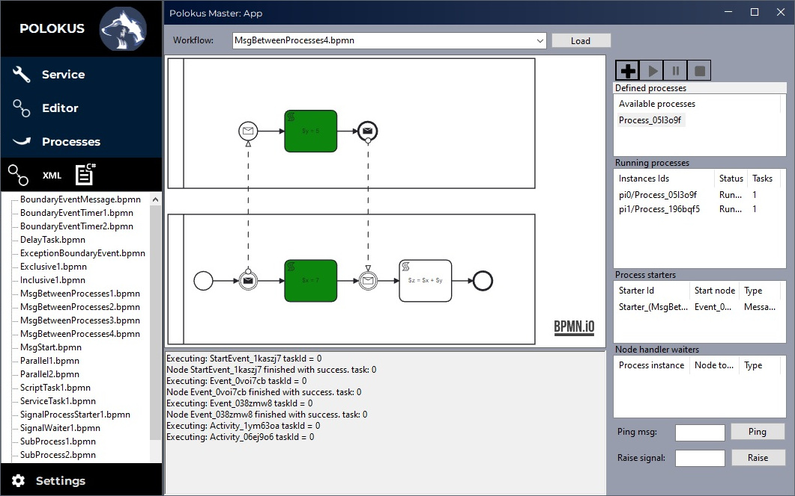

---

This project focuses on creating a simple engine that processes business processes defined by <a href="https://www.omg.org/spec/BPMN/2.0/PDF">BPMN 2.0</a> standard. Program has a support for projecting, managing and tracking running processes. Graph editor is made by <a href="https://bpmn.io/">bpmn.io</a>, engine is written in .NET 6.0 platform, UI made with Windows Forms.

# Installation

Download link $\rightarrow$ **soon!**

- Download and run an installer
- Follow the installation process
- Make sure `config.ini` file is in same directory as **Polokus.App.exe** and **Polokus.Service.exe**
- Change configuration as you want and run Polokus.App.exe
- If you want to run processes in background, make sure Polokus Service is running: \
`Ctrl+Alt+Delete` $\rightarrow$ Task Manager $\rightarrow$ Services

# Overview

Polokus is a management system for business processes. You can run your processes via background service and schedule them with crone timetables, mailbox, changes in filesystem or your own events. Included GUI application allows you to track their state and provides graphic editor to create simple or advanced BPMN processes. Here is how the application looks like:

<p align="center">

</p>

# Configuration

Polokus can be configured with settings file (`config.ini`) and externals file (`externals.json`) which allows you to attach custom modules, defining monitors (objects that can raise signals) or ServiceTasks.

### > config.ini
```ini
[Main]
BpmnPath = ./BPMN     # > Path to directory with .bpmn files
                      #   that will be parsed to Workflows.

[App]
DelayPerNodeHandlerMs = 0  # > When app is connected to Polokus Service,
                           #   executing of every node can be delayed
                           #   by time defined here so that you can see
                           #   on diagram which node is active.
UseRemotePolokus = False   # > Flag to decide if you want to connect
                           #   application to service (true) or you want
                           #   to run processes only inside app (false).
RemotePolokusUri = http://localhost:3000 # > Endpoint on which service is listening.

[Service]
MessageListenerPort = 8085       # > Message communication within a process
                                 #   is made with pinging localhost port.
                                 #   Set a free port here.
ExternalsPath = ./externals.json # > Path to file with externals.
TimeoutForProcessSec = -1        # > Maximum time after which kill single process
                                 #   if not finished yet. -1 means infinity.
RestoreProcessesOnStart = False  # > If application close when there are some
                                 #   not finished processes, service will continue
                                 #   processing it when this flag is set.
```

### > externals.json
```json
{
  "SettingsProvider": 
    {
      "Name": "",
      "Assembly": "",
      "ClassName": ""
    }
  "ServiceTasks": [
    {
      "Name": "",
      "Assembly": "",
      "ClassName": "",
      "ServiceTaskName": ""
    }
  ],
  "Monitors": [
    {
      "Name": "",
      "Assembly": "",
      "ClassName": "",
      "Arguments": [ "" ]
    },
    {
      "Name": "",
      "Assembly": "",
      "ClassName": "",
      "Arguments": [ "" ],
      "Dependencies": [ "" ]
    }
  ],
  "HooksProviders": [
    {
      "Name": "",
      "Assembly": "",
      "ClassName": ""
    }
  ]
}
```

> @ Bartłomiej Grochowski 2022-2023